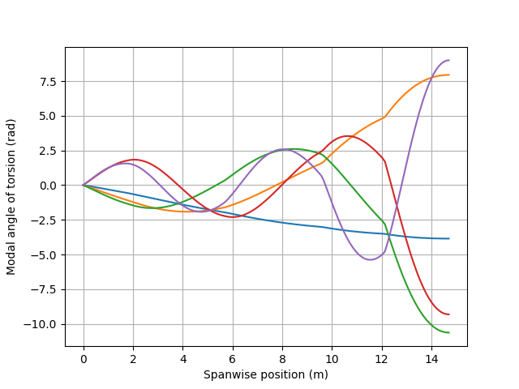
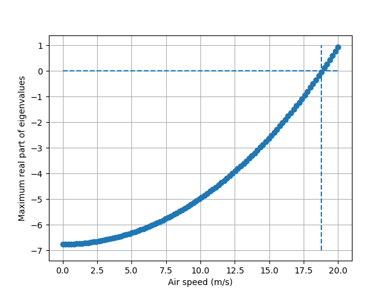
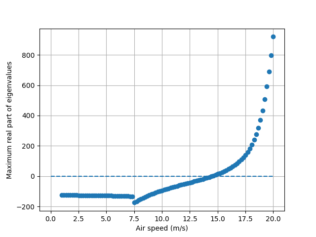
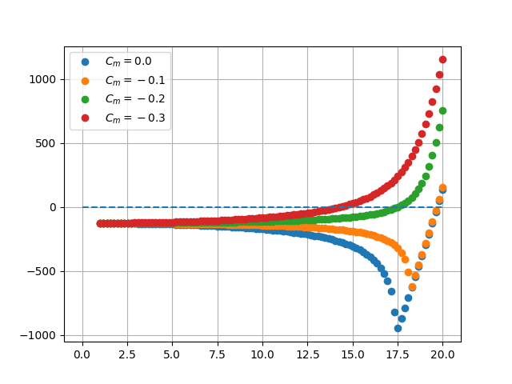

## はじめに
**安全に資する使い方をしてください．**

このリポジトリは弾性翼のねじり弾性モード抽出，ダイバージェンス速度の計算，フゴイド連成ダイバージェンス速度の計算に対応しています．

あくまで特定の現象のみを計算したものであるため，ここで計算される速度以下で飛行しても必ずしも安全ではないことをご留意ください．

## 理論に関するテキスト
このリポジトリにあるプログラムの背景となる理論については「ダイバージェンス現象に関連する理論と計算.pdf」に記載されています．
もし追加の説明が必要な場合は都度ご連絡ください．

## 導入方法
まずpythonとgitの動く環境を用意してください．
次に，このリポジトリをクローンしてください．
```
git clone https://github.com/FlyingSheeps/Phugoid-divergence.git
```
最後に必要なモジュールをインストールするために，requirements.txtを利用してください．
使い方は以下のとおりです．
```
pip install -r requirements.txt
```
これによって必要なモジュールはすべてインストールされ，pythonプログラムが実行可能になります．

## 各プログラムの紹介

torsionalModeDetection.py

このプログラムはwing.csvからねじり剛性・区間あたりの重量・コード長を読み込んで有限要素法でねじり弾性のモードを計算します．
計算結果は-modalのつくプログラムで使用されます．
実行はsrcディレクトリで以下のように実行してください．
```
python3 torsionalModeDetection.py
```



divergence.py

このプログラムはwing.csvからねじり剛性・桁位置・コード長を読み込んで有限要素法でダイバージェンス速度を計算します．
計算の結果得られる速度に対する最大固有値プロットのゼロクロス速度がダイバージェンス速度になります．
実行はsrcディレクトリで以下のように実行してください．
```
python3 divergence.py
```



phugoid-divergence-modal.py

これは計算した弾性モードに基づいてフゴイド運動と連成した場合のダイバージェス速度を計算します．
飛行速度に応じて揚力が一定になるように揚力係数を調整しながらフゴイド連成ダイバージェンスモードを計算します．
divergence.pyと同様に，計算の結果得られる速度に対する最大固有値プロットのゼロクロス速度がダイバージェンス速度になります．
実行はsrcディレクトリで以下のように実行してください．
```
python3 phugoid-divergence-modal.py
```



phugoid-divergence-modal-fixedCL.py

これは計算した弾性モードに基づいてフゴイド運動と連成した場合のダイバージェス速度を計算します．
phugoid-divergence-modal.pyと違って飛行速度に応じて揚力係数を変更しません．そのため，これで計算した場合は上昇飛行をしている状態です．
テキストで説明のために用いただけの実用性はないプログラムです．



## wing.csvの構成
wing.csvはヘッダー行とそれに対応する値が列として入っているpandasで使用する前提のcsvファイルです．
不等間隔のデータでも補完して等間隔に修正されて使用されます．これはscipy.interpolate.interp1dの許容するデータであれば問題ないです．
wing.csvを書き換える場合は以下の手順で行ってください．
1. まずspanにmm単位の翼根から翼端までの代表点位置を記述する．
2. その代表点位置と同じ行に代表点位置におけるねじり剛性などを入力する．
3. 空力係数を計算した際の釣り合い状態の飛行速度をU0に入力する．


入力するデータの種類と単位は以下の通りです．
MACは%ではなく割合で記入してください．
U0は最初のセルのみ入力されていれば十分です．
- span：スパン方向位置 (mm)  
- mass：区間の重量 (kg)  
- EI：上下曲げ剛性 (Pa m^4)  
- GIp：ねじり剛性 (Pa m^4)
- c：コード長 (mm)
- T.C.：ねじり中心or桁位置 (MAC)
- Cm：モーメント係数 (-)
- CL：揚力係数 (-)
- U0：入力した空力係数を計算した飛行速度 (m/s)　　

| span | mass | EI   | GIp  | c    | T.C. | Cm   | CL   | U0   |
| ---- | ---- | ---- | ---- | ---- | ---- | ---- | ---- | ---- |
| 0    | XXXX | XXXX | XXXX | XXXX | XXXX | XXXX | XXXX | XXXX |
| 100  | XXXX | XXXX | XXXX | XXXX | XXXX | XXXX | XXXX |      |
| 200  | XXXX | XXXX | XXXX | XXXX | XXXX | XXXX | XXXX |      |
| ⁝    |⁝    |⁝    |⁝    |⁝    |⁝    |⁝    |⁝    |⁝    |⁝    |
| 14800 | XXXX | XXXX | XXXX | XXXX | XXXX | XXXX | XXXX |      |  
| 14900 | XXXX | XXXX | XXXX | XXXX | XXXX | XXXX | XXXX |      |  
| 15000 | XXXX | XXXX | XXXX | XXXX | XXXX | XXXX | XXXX |      |  

